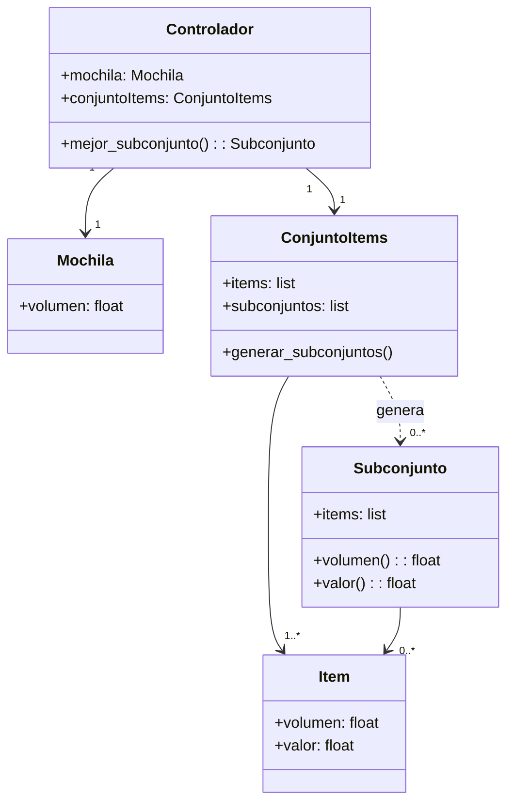

###### Instalar Markdown Preview Mermaid Support (Es una extensión extensión)

```mermaid
classDiagram
    class Mochila {
        +volumen: float
    }

    class Controlador {
        +mochila: Mochila
        +conjuntoItems: ConjuntoItems
        +mejor_subconjunto(): Subconjunto
    }

    class ConjuntoItems {
        +items: list
        +subconjuntos: list
        +generar_subconjuntos()
    }

    class Subconjunto {
        +items: list
        +volumen(): float
        +valor(): float
    }

    class Item {
        +volumen: float
        +valor: float
    }

    Controlador "1" --> "1" Mochila
    Controlador "1" --> "1" ConjuntoItems
    ConjuntoItems ..> "0..*" Subconjunto : genera
    ConjuntoItems --> "1..*" Item
    Subconjunto --> "0..*" Item
```